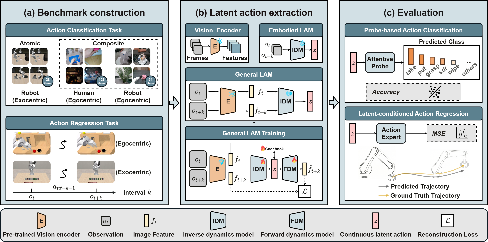

# LARY — A Latent Action Representation Yielding Benchmark for Generalizable Vision-to-Action Alignment

<p align="center">
  
</p>

<p align="center">
  <a href="https://meituan-longcat.github.io/LARYBench/"></a>
  &nbsp;
  <a href="https://arxiv.org/abs/2604.11689"></a>
  &nbsp;
  <a href="https://huggingface.co/datasets/meituan-longcat/LARYBench"></a>
  &nbsp;
  <a href="https://modelscope.cn/datasets/meituan-longcat/LARYBench"></a>
  &nbsp;
  <a href="LARYBench.pdf"></a>
  &nbsp;
  <a href="https://discord.gg/EXsG52D8SW"></a>
  &nbsp;
  <a href="https://opensource.org/licenses/MIT"></a>
</p>

**LARY** is a unified evaluation framework for **latent action representations**.
Given any model that produces latent action representations (LAMs or visual encoders), LARY provides three complementary evaluation pipelines:

| Pipeline | Task |
|---|---|
| **`get_latent_action`** | Extract latent action representations from videos or image pairs |
| **`classification`** | Probe how well latent actions capture *action semantics* (action-type recognition) |
| **`regression`** | Probe how well latent actions can *decode physical robot actions* (action regression) |

---

## News
- **[2026-04-15]** We release the training datasets.
- **[2026-04-13]** We release the code, text annotations, and partial validation datasets. Training datasets are coming soon.

## Release Checklist

- [x] Code
- [x] Text annotations
- [x] Validation datasets
- [x] Training datasets

---

## Table of Contents

1. [Overview](#overview)
2. [Contributions](#contributions)
3. [Environment Setup](#environment-setup)
4. [Quick Start — End-to-End Pipeline](#quick-start--end-to-end-pipeline)
5. [Step 1 · get\_latent\_action](#step-1--get_latent_action)
   - [Extracting Latent Actions (Video Mode)](#extracting-latent-actions-video-mode)
   - [Extracting Latent Actions (Image-Pair Mode)](#extracting-latent-actions-image-pair-mode)
   - [Supported Models](#supported-models)
   - [Adding a New LAM](#adding-a-new-lam)
6. [Step 2 · Classification](#step-2--classification)
   - [Running Classification](#running-classification)
7. [Step 3 · Regression](#step-3--regression)
   - [Running Regression](#running-regression)
8. [Supported Datasets](#supported-datasets)
9. [Data Directory Layout](#data-directory-layout)
10. [Environment Variables Reference](#environment-variables-reference)

---

## Overview

While the shortage of explicit action data limits Vision-Language-Action (VLA) models, human action videos offer a scalable yet unlabeled data source. A critical challenge in utilizing large-scale human video datasets lies in transforming visual signals into ontology-independent representations, known as latent actions. However, the capacity of latent action representation to derive robust control from visual observations has yet to be rigorously evaluated.

We introduce the Latent Action Representation Yielding (LARY) Benchmark, a unified framework for evaluating latent action representations on both high-level semantic actions (*what to do*) and low-level robotic control (*how to do*). The comprehensively curated dataset encompasses over one million videos (1,000 hours) spanning 151 action categories, alongside 620K image pairs and 595K motion trajectories across diverse embodiments and environments. Our experiments reveal two crucial insights: (i) General visual foundation models, trained without any action supervision, consistently outperform specialized embodied LAMs. (ii) Latent-based visual space is fundamentally better aligned to physical action space than pixel-based space. These results suggest that general visual representations inherently encode action-relevant knowledge for physical control, and that semantic-level abstraction serves as a fundamentally more effective pathway from vision to action than pixel-level reconstruction.

<p align="center">
  
</p>

## Contributions

- **LARYBench**: We introduce LARYBench, a comprehensive benchmark that first decouples the evaluation of latent action representations from downstream policy performance. LARYBench probes representations along two complementary dimensions — high-level semantic action (*what to do*) encoding and the low-level physical dynamics required for robotic control (*how to do it*) — enabling direct, standardized measurement of representation quality itself.

- **Large-Scale Data Engine**: To support rigorous evaluation, we develop an automated data engine to re-segment and re-annotate a large-scale corpus, yielding 1.2M videos, 620K image pairs, and 595K trajectories across 151 action categories and 11 robotic embodiments, covering both human and robotic agents from egocentric and exocentric perspectives in simulated and real-world environments.

- **Key Findings**: Through systematic evaluation of 11 models, we reveal two consistent findings: (i) action-relevant features can emerge from large-scale visual pre-training without explicit action supervision, and (ii) latent-based feature spaces tend to align with robotic control better than pixel-based ones. These results suggest that future VLA systems may benefit more from leveraging general visual representations than from learning action spaces solely on scarce robotic data.

---

## Environment Setup

### 1. Clone the repository

### 2. Create conda environments

Different LAMs require different environments.
The project ships with a helper function `lary_activate <model>` in `env.sh`.

| LAM | Environment |
|---|---|
| `lapa`, `lapa-dinov2`, `lapa-dinov3`, `lapa-siglip2`, `lapa-magvit2`, `univla`, `dinov3`, `lapa-dinov3-cs*`, `flux2` | `laq` |
| `vjepa2` | `vjepa2` |
| `wan2-2` | `wan` |
| `villa-x` | dedicated `.venv` inside `$VILLA_X_DIR` |

**Base environment (`laq`)**:

```bash
conda create -n laq python=3.10 -y
conda activate laq
pip install torch torchvision --index-url https://download.pytorch.org/whl/cu118
pip install einops transformers omegaconf tqdm pandas numpy opencv-python pillow \
            scikit-image accelerate diffusers wandb timm decord seaborn scikit-learn
```

**V-JEPA 2 environment**:

```bash
conda create -n vjepa2 python=3.10 -y
conda activate vjepa2
pip install torch torchvision
pip install einops transformers tqdm pandas numpy opencv-python pillow decord
```

### 3. Configure environment variables

Edit `env.sh` to point to your file system, then source it:

```bash
# Minimal required variables
export LARY_ROOT=/path/to/LARY
export DATA_DIR=/path/to/LARYBench          # LARYBench dataset root (classification/ + regression/)
export LARY_LA_DIR=/path/to/latent_actions  # where extracted .npz files are stored
export MODEL_DIR=/path/to/pretrained_lam_weights
export LARY_LOG_DIR=/path/to/logs

source /path/to/LARY/env.sh
```

Key variables and their roles are documented in [Environment Variables Reference](#environment-variables-reference).

---

## Quick Start — End-to-End Pipeline

The following example runs all three stages on the **CALVIN** dataset using **LAPA-DINOv2** as the LAM.

```bash
source env.sh
conda activate laq         

# ── Stage 1: Extract latent actions ────────────────────────────────────────
# Input CSVs are already in data/; no --input flag needed.
python -m lary.cli extract \
    --model dinov2 \
    --dataset calvin \
    --split train \
    --mode image \
    --stride 5

python -m lary.cli extract \
    --model dinov2 \
    --dataset calvin \
    --split val \
    --mode image \
    --stride 5
# → writes data/train_la_calvin_5_dinov2.csv
# → writes data/val_la_calvin_5_dinov2.csv
# → writes npz files under $LARY_LA_DIR/calvin/stride_5/{train,val}/dinov2/

# ── Stage 2: Regression ─────────────────────────────────────────────────────
conda activate lerobot2

python -m lary.cli regress \
    --model dinov2 \
    --dataset calvin \
    --stride 5 \
    --model-type mlp
```

For **classification** (video-based datasets):

```bash
# Extract
conda activate laq

python -m lary.cli extract \
    --model dinov2 \
    --dataset robot_1st \
    --split train \
    --mode video

python -m lary.cli extract \
    --model dinov2 \
    --dataset robot_1st \
    --split val \
    --mode video
# → writes data/train_la_robot_1st_dinov2.csv
# → writes data/val_la_robot_1st_dinov2.csv

# Classify
conda activate vjepa2

python -m lary.cli classify \
    --model dinov2 \
    --dataset human_1st \
    --dim 1024 \
    --classes 123
```

---

## Step 1 · get\_latent\_action

All metadata CSVs required as input are **pre-built** in `data/` with relative paths.
They are resolved at runtime via the `DATA_DIR` environment variable.

---

### Extracting Latent Actions (Video Mode)

Used for **classification** datasets (`human_1st`, `robot_1st`, `libero`).

#### Via unified CLI (recommended)

```bash
python -m lary.cli extract \
    --model <model_name> \
    --dataset <dataset_name> \
    --split <train|val> \
    --mode video
```

The CLI automatically reads `data/{dataset}_metadata_{split}.csv`.
To override the input file, use `--input /path/to/custom.csv`.

#### Distributed / partitioned extraction

For large datasets, use `--num_partitions` to split work across GPUs:

```bash
for PART in 0 1 2 3 4 5 6 7; do
    CUDA_VISIBLE_DEVICES=$PART python -m lary.cli extract \
        --model <model_name> \
        --dataset <dataset_name> \
        --split train \
        --mode video \
        --num_partitions 8 \
        --partition $PART &
done
wait
```

Each job writes `data/{split}_la_{dataset}_{model}_{partition}.csv`.
Merge the partitions manually into a single `data/{split}_la_{dataset}_{model}.csv`.

---

### Extracting Latent Actions (Image-Pair Mode)

Used for **regression** datasets (`calvin`, `vlabench`, `agibotbeta`, `robocoin`).

```bash
python -m lary.cli extract \
    --model <model_name> \
    --dataset <dataset_name> \
    --split <split> \
    --mode image \
    --stride <stride>
```

**Output CSV naming** (written to `data/` automatically):

| Mode | Output CSV |
|---|---|
| `image` (with stride) | `data/{split}_la_{dataset}_{stride}_{model}.csv` |
| `video` | `data/{split}_la_{dataset}_{model}.csv` |

---

### Supported Models

| Model key | Architecture | Mode | Notes |
|---|---|---|---|
| `lapa` | LAQ | both | Loads from `$MODEL_DIR/laq_openx.pt` |
| `dinov2` | DINOv2 + LAQ | both | Loads from `$MODEL_DIR/laq_dinov2.pt` |
| `dinov3` | DINOv3 + LAQ | both | Loads from `$MODEL_DIR/laq_dinov3.pt` |
| `dinov3-origin` | DINOv3-ViTL16 (raw features) | both | No LAQ head; outputs patch features |
| `dinov3-cs{N}_sl{L}_dim{D}_lr{lr}` | DINOv3 + custom LAQ | both | E.g. `dinov3-cs8_sl16_dim32_lr1e-4` |
| `siglip2` | SigLIP2 + LAQ | both | Loads from `$MODEL_DIR/siglip2.pt` |
| `magvit2` | Open-MAGVIT2 + LAQ | both | Requires `MAGVIT2_CONFIG_PATH` / `MAGVIT2_TOKENIZER_PATH` |
| `univla` | UniVLA | both | Loads from `CKPT_PATH/lam-stage-2.ckpt` |
| `villa-x` | villa-X | both | Requires `VILLA_X_CKPT_PATH` and its `.venv` |
| `flux2` | FLUX.2-dev VAE | both | Requires `AE_MODEL_PATH` (safetensors) |
| `wan2-2` | Wan 2.2 VAE | both | Requires `wan` conda env |
| `vjepa2` | V-JEPA 2 ViT-L/16 | both | Requires `vjepa2` conda env + `vitl.pt` checkpoint |

---

### Adding a New LAM

Integrating a new LAM requires edits to a **single file**: `get_latent_action/dynamics.py`.

#### Step 1 — Add the import guard (top of file)

```python
env_model = os.environ.get("USE_MODEL")
if env_model == 'my-new-model':
    from path.to.my_new_model import MyNewModel
```

#### Step 2 — Register the model in `get_dynamic_tokenizer()`

```python
def get_dynamic_tokenizer(model):
    ...
    elif model == 'my-new-model':
        dynamics = MyNewModel(
            # constructor arguments
        ).cuda()
        dynamics.load_state_dict(torch.load(f"{model_dir}/my_new_model.pt"))
    ...
    freeze_backbone(dynamics)
    return dynamics
```

#### Step 3 — Handle the forward pass in `get_latent_action()`

```python
def get_latent_action(x, tokenizer, model_name):
    with torch.no_grad():
        ...
        elif model_name == 'my-new-model':
            # x shape: (B, C, T, H, W) — adjust as needed
            tokens = tokenizer(x)           # → (B, N, D)
            indices = torch.zeros(B, N)     # or actual codebook indices
        ...
    return tokens.cpu().numpy(), indices.cpu().numpy()
```

#### Step 4 — Handle the batch loop in extraction scripts

If your model needs custom batching (e.g. different input shape), add the corresponding
`elif self.args.model == 'my-new-model':` branch in:

- `get_latent_action/get_latent_action.py` → `ActionProcessor.process()`
- `get_latent_action/get_latent_action_img.py` → `ActionProcessor.process()`
- `lary/extract.py` → `LatentActionExtractor._process_batch()`

#### Step 5 — Activate the right conda env

Add the model to the `lary_activate` function in `env.sh`:

```bash
lary_activate() {
    case "$model" in
        ...
        "my-new-model") conda activate my_new_env ;;
        ...
    esac
}
```

**That's it.** The classification and regression pipelines are fully model-agnostic
and will work without any further changes.

---

## Step 2 · Classification

The classification probe trains a lightweight **`FeatureEvaluator`** classifier
(multi-head MLP with attention pooling) on top of frozen latent action features.

### Running Classification

#### Via unified CLI

```bash
python -m lary.cli classify \
    --model <lam_name> \
    --dataset <dataset_name> \
    --dim <latent_dim> \
    --classes <num_classes> \
    --gpus 0,1,2,3,4,5,6,7
```

The CLI reads `data/train_la_{dataset}_{model}.csv` and `data/val_la_{dataset}_{model}.csv` automatically.

#### Via direct script (multi-GPU DDP)

```bash
MASTER_PORT=11325 python -m classification.evals.main \
    --fname classification/configs/eval/vitl/manipulation.yaml \
    --lam <lam_name> \
    --dataset <dataset_name> \
    --dim <latent_dim> \
    --classes <num_classes> \
    --devices cuda:0 cuda:1 cuda:2 cuda:3 cuda:4 cuda:5 cuda:6 cuda:7
```

#### Outputs

| File | Description |
|---|---|
| `latest.pt` | Latest checkpoint (classifiers + optimizers) |
| `log_r0.csv` | Per-epoch train/val accuracy CSV |
| `confusion_matrix.json` | Full confusion matrix |
| `confusion_matrix.png` | Confusion matrix heatmap |
| `classification_stats.json` | Per-class precision / recall / F1 |
| `case.txt` | Per-sample prediction file |

---

## Step 3 · Regression

The regression probe trains a **MLPResNet** or **DiT-based diffusion decoder**
to predict physical robot action sequences from latent action representations.

### Running Regression

#### Via unified CLI

```bash
python -m lary.cli regress \
    --model <lam_name> \
    --dataset <dataset_name> \
    --stride <stride> \
    --model-type mlp       # or 'dit'
```

The CLI reads `data/train_la_{dataset}_{stride}_{model}.csv` and the corresponding val CSV automatically.

#### Via accelerate (multi-GPU)

```bash
accelerate launch \
    --num_processes=8 \
    regression/main.py \
    --train_csv data/train_la_calvin_5_dinov2.csv \
    --val_csv   data/val_la_calvin_5_dinov2.csv \
    --dataset   calvin \
    --stride    5 \
    --model_type mlp \
    --wandb_project lary \
    --wandb_name dinov2-calvin-5-mlp
```

For datasets with `seen_train` / `seen_val` / `unseen` splits (AgiBotWorld-Beta, RoboCOIN):

```bash
accelerate launch \
    --num_processes=8 \
    regression/main.py \
    --train_csv data/seen_train_la_agibotbeta_45_dinov2.csv \
    --val_csv   data/seen_val_la_agibotbeta_45_dinov2.csv \
    --val_unseen_csv data/unseen_la_agibotbeta_45_dinov2.csv \
    --dataset   agibotbeta \
    --stride    45 \
    --model_type mlp
```

#### Model type options

| `--model_type` | Architecture | Notes |
|---|---|---|
| `mlp` | MLPResNet (MLP + residual blocks) | Fast, good for simple action spaces |
| `dit` | DiT (Diffusion Transformer) | More expressive; slower inference |

#### Key arguments

| Argument | Default | Description |
|---|---|---|
| `--stride` | 5 | Number of action steps per sample (chunk size) |
| `--global_stats_json` | None | JSON with per-robot mean/std (required for AgiBotWorld-Beta / RoboCOIN) |
| `--val_unseen_csv` | None | Optional CSV for out-of-distribution (unseen) evaluation |
| `--dit_hidden_size` | 512 | Hidden size for DiT decoder |
| `--dit_depth` | 6 | Number of DiT blocks |

#### Outputs

| File | Description |
|---|---|
| `best_model.pth` | Checkpoint with lowest validation MSE |
| `best_result.csv` | Best epoch metrics (MSE per dimension / group) |
| `eval_vis/epoch_*/` | Visualisation plots: GT vs. predicted trajectories |

---

## Supported Datasets

### Classification datasets (video mode)

| Dataset key | Split names | Data sub-path |
|---|---|---|
| `human_1st` | `train`, `val` | `DATA_DIR/classification/` (mixed sub-dirs) |
| `robot_1st` | `train`, `val` | `DATA_DIR/classification/` |
| `libero` | `train`, `val` | `DATA_DIR/classification/LIBERO/` |

### Regression datasets (image-pair mode)

| Dataset key | Split names | Stride | Data sub-path |
|---|---|---|---|
| `calvin` | `train`, `val` | 5 | `DATA_DIR/regression/calvin/{split}_stride5/` |
| `vlabench` | `train`, `val` | 5 | `DATA_DIR/regression/vlabench/` |
| `vlabench_15` | `train`, `val` | 15 | `DATA_DIR/regression/vlabench/` |
| `vlabench_30` | `train`, `val` | 30 | `DATA_DIR/regression/vlabench/` |
| `agibotbeta` | `seen_train`, `seen_val`, `unseen` | 45 | `DATA_DIR/regression/agibot_45/` |
| `robocoin` | `seen_train`, `seen_val`, `unseen` | 10 | `DATA_DIR/regression/robocoin_10/` |

---

## Data Directory Layout

```
$LARY_ROOT/data/                             ← committed metadata CSVs
├── {dataset}_metadata_{split}.csv           # input to extract (relative paths)
└── {split}_la_{dataset}_{stride}_{model}.csv  # output of extract (la_path column added)

$DATA_DIR/                                   ← LARYBench dataset root (env: DATA_DIR)
├── classification/
│   ├── EPIC-KITCHENS/
│   ├── EgoDex/
│   ├── AgiBotWorld-Beta/
│   ├── LIBERO/
│   └── ...
└── regression/
    ├── calvin/{train_stride5,val_stride5}/
    ├── vlabench/
    ├── agibot_45/
    ├── robocoin_10/
    └── vlabench_{15,30}/  (symlink or separate)

$LARY_LA_DIR/                                ← extracted .npz files (env: LARY_LA_DIR)
└── {dataset}/
    ├── {model}/                             # no-split: human_1st, robot_1st, libero
    ├── {split}/{model}/                     # standard split
    └── stride_{N}/{split}/{model}/          # stride datasets: calvin, vlabench, agibotbeta, robocoin

$MODEL_DIR/                                  ← LAM weight files (env: MODEL_DIR)
├── laq_openx.pt        # lapa
├── laq_dinov2.pt       # lapa-dinov2
├── laq_dinov3.pt       # lapa-dinov3
├── siglip2.pt          # lapa-siglip2
└── magvit2.pt          # lapa-magvit2
```

---

## Environment Variables Reference

| Variable | Required | Description |
|---|---|---|
| `LARY_ROOT` | ✓ | Project root directory |
| `LARY_LOG_DIR` | ✓ | Log / checkpoint output directory |
| `DATA_DIR` | ✓ | LARYBench dataset root (`classification/` + `regression/` sub-dirs) |
| `LARY_LA_DIR` | ✓ | Latent action storage root (written by extract, read by downstream tasks) |
| `MODEL_DIR` | ✓ | Pre-trained LAM weight files |
| `DINO_V2_PATH` | | DINOv2 model directory |
| `DINO_V3_PATH` | | DINOv3 model directory |
| `SIGLIP2_PATH` | | SigLIP2 model directory |
| `MAGVIT2_CONFIG_PATH` | | Open-MAGVIT2 config YAML |
| `MAGVIT2_TOKENIZER_PATH` | | Open-MAGVIT2 checkpoint |
| `CONDA_SH_PATH` | | Path to `conda.sh` profile |
| `WANDB_API_KEY` | | Weights & Biases API key |
| `WANDB_PROJECT` | | Default W&B project name (default: `lary`) |

---

## Citation

If you find this work useful, please cite:

```bibtex
@misc{nie2026larylatentactionrepresentation,
      title={LARY: A Latent Action Representation Yielding Benchmark for Generalizable Vision-to-Action Alignment}, 
      author={Dujun Nie and Fengjiao Chen and Qi Lv and Jun Kuang and Xiaoyu Li and Xuezhi Cao and Xunliang Cai},
      year={2026},
      eprint={2604.11689},
      archivePrefix={arXiv},
      primaryClass={cs.CV},
      url={https://arxiv.org/abs/2604.11689}, 
}
```

---

## Data Statements

LARYBench is built upon the following publicly available datasets. We gratefully acknowledge the efforts of their creators and ask users to comply with each dataset's respective license and terms of use.

| Dataset | Link |
|---|---|
| EgoDex | [github.com/apple/ml-egodex](https://github.com/apple/ml-egodex) |
| Something-Something V2 | [something-something-v2](https://www.qualcomm.com/developer/software/something-something-v-2-dataset) |
| Ego4D | [github.com/facebookresearch/Ego4d](https://github.com/facebookresearch/Ego4d) |
| HoloAssist | [holoassist.github.io](https://holoassist.github.io/) |
| EPIC-KITCHENS | [epic-kitchens.github.io](https://epic-kitchens.github.io/) |
| TACO | [taco2024.github.io](https://taco2024.github.io/) |
| AgiBotWorld-Beta | [github.com/OpenDriveLab/AgiBot-World](https://github.com/OpenDriveLab/AgiBot-World) |
| LIBERO | [github.com/Lifelong-Robot-Learning/LIBERO](https://github.com/Lifelong-Robot-Learning/LIBERO) |
| RoboCOIN | [github.com/FlagOpen/RoboCOIN](https://github.com/FlagOpen/RoboCOIN) |
| VLABench | [github.com/OpenMOSS/VLABench](https://github.com/OpenMOSS/VLABench) |
| CALVIN | [github.com/mees/calvin](https://github.com/mees/calvin) |

---

## Acknowledgements

We thank the following open-source projects for their contributions:

- [V-JEPA2](https://github.com/facebookresearch/vjepa2)
- [UniVLA](https://github.com/OpenDriveLab/UniVLA)
- [Wan2.2](https://github.com/Wan-Video/Wan2.2)
- [flux2](https://github.com/black-forest-labs/flux2)
- [villa-x](https://github.com/microsoft/villa-x)
- [Open-MAGVIT2](https://github.com/tencentarc/seed-voken)
- [SigLIP2](https://github.com/google-research/big_vision/tree/main)
- [DINOv2](https://github.com/facebookresearch/dinov2)
- [DINOv3](https://github.com/facebookresearch/dinov3)

## Support
Please contact us at <a href="mailto:longcat-team@meituan.com">longcat-team@meituan.com</a> or join our WeChat Group if you have any questions.

#### WeChat Group

